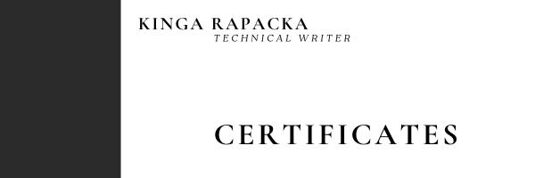

---
title: Certificates
layout: default
nav_order: 3
--- 

     

As a teacher and technical writer, I am committed to staying at the forefront of technology and innovation. Over the years, I’ve earned a range of certifications that enhance my ability to teach complex subjects, communicate technical information clearly, and apply cutting-edge tools such as Generative AI. These certifications not only demonstrate my expertise but also my dedication to continuous learning and professional growth.

They empower me to combine cutting-edge technologies like Generative AI with my passion for teaching and technical writing. They help me not only teach new and emerging topics with authority but also write clear, insightful documentation that reflects the latest advancements in technology. By staying updated with the latest in AI and other fields, I ensure that my students and readers receive the most relevant and impactful information.

## **Professional Development:**

| Date Completed | Certificate Title    | Issued By |
| ----           | -----------          | ----      |
| 2025.03 | Artificial Intelligence (AI) for Everyone 2025|Santander Open Academy/Lodz University of Technology|
| 2025.03.19 | Using AI in Business Development |Google/Waarsaw School of Economy|
| 2025.02| Google AI Essentials |Coursera|
| 2025.02.06 |Count to 20! – 20 Rules for Time Management and Communication | WSB University |
| 2024.12.05 | Effective Business Writing|Santander Open Academy|
| 2024.11.09 | Generative AI|Santander Open Academy/MIT Professional Education|
| 2024.09.14 | Scrum Basics - Agile Project Management| Santander Open Academy|
| 2024.09.09 | Google: Artificial intelligence and productivity| Santander Open Academy/Google|
| 2024.10.11 | Academy of MOTIVATION| Saint Wojciech publishing House|
| 2024.09.25 | Discover the Art of Presentation. Design, Colors, and Composition in Practice|Saint Wojciech publishing House|
| 2024.09.21 | Virtual Reality and the Metaverse Environment |WSB University|
| 2024.09.20 | Pillars of Leadership Potential Assessment in Modern Organizations|WSB University|
| 2024.09.20 | How to Divide the Cake? Modern Methods of Negotiation| WSB University|
| 2024.09.18   |New Technologies, New Challenges: Data Security in a Changing World|WSB University|
| 2024.09.17   | Crucible of Reality: Deepfake Threats and Challenges in the Age of Digital Manipulation | WSB University|
| 2024.09.17 | Artificial Intelligence: Successful Application Examples | WSB University |
| 2024.09.16 | Language Models – Friend or Foe? | WSB University |
| 2024.09.16 |AI in Business – Harness the Potential of Artificial Intelligence in Your Company| WSB University|

## **Personal Development:**

| Date Completed | Certificate Title    | Issued By |
| ----           | -----------          | ----      |
| 2024.10.23 | Narrative Analysis in Working with the Bible        | Wydawnictwo WAM |
| 2024.09.22 | Adolescent in a Mental Health Crisis – How to Recognize? How to Respond? How to Help? | WSB University|
| 2024.09.20 | The Importance of 'Ego' and 'Mojo' in Leadership: How to Develop and Maintain Engagement by Building an Authentic Leadership Model| WSB University|
| 2024.04.25 | Mindful Supplementation – How to Tailor Supplements to Your Needs | Saint Wojciech publishing House|
| 2024.02.29 | Passivity or Activity – Response to Suicide|Saint Wojciech publishing House |
| 2023.11.15 | Find Your Inner Balance!|Saint Wojciech publishing House |
| 2023.02.23 | Crisis Interventions for Children and Adolescents| Saint Wojciech publishing House |
| 2023.02.11 | Where Does Speech Reside? – Neurological Aspects of Speech Development|WSB University |
| 2022.02.09 | Legal Foundations of the Religious Education Teacher Profession | Wydawnictwo WAM|
| 2021.05.31 | School of Thinking"| Specialist Education Center EDU-MACH |

## **Education & Teaching:**

| Date Completed | Certificate Title    | Issued By |
| ----           | -----------          | ----      |
| 2024.09.21 | With Empathy from Preschool       | WSB University|
| 2024.09.16 |Enslavement or Development? Dilemmas of Contemporary Education and Schools| WSB Univeristy|
| 2024.05.23|Calm Amongst the Turmoil|Saint Wojciech publishing House|
|2024.03.13|The Catechist in the Context of Homeschooling|Saint Wojciech publishing House|
|2024.03.09|21st National Catechetical Symposium ‘RETURN TO THE ORIGINAL LOVE’|Saint Wojciech publishing House |
|2024.02.07|Smiling Saints in Religious Education|Saint Wojciech publishing House|
|2024.01.31|Greek in Catechesis|Saint Wojciech publishing House |
|2023.12.14|Rollers, Relationships, Movies. New Technologies in Education|Saint Wojciech publishing House |
|2023.11.30|Advent JOY!|Saint Wojciech publishing House |
|2023.09.27|Evangelization in the Contemporary World: Ideas, Resources, Methods|Saint Wojciech publishing House |
|2023.09.06|Christian Board Games as Modern and Effective Educational Methods|Saint Wojciech publishing House|
|2023.03.11|21st National Catechetical Symposium ‘The Catechist in the Modern World|Saint Wojciech publishing House |
|2023.03.02|Do It Yourself – Methodological Support for Early School Catechists|Saint Wojciech publishing House |
|2023.02.08|Icon Writing and Handicrafts in Religious Education|Saint Wojciech publishing House|
|2023.04.03|How to Prevent Self-Harm and Other Destructive Behaviors in Students?|Specialist Education Center EDU-MACH|
|2023.04.03|Autism – Working on Behaviors|Specialist Education Center EDU-MACH|
|2023.01.04|The EPIPHANY – A Demonstration Religious Lesson|Saint Wojciech publishing House|
|2022.04.2|How to Use Film in Religious Education Lessons?|Wydawnictwo WAM|
|2022.04.20|Preparation for the Sacraments for Students with Special Educational Needs|Saint Wojciech publishing House|
|2021.11.04|Chronically Ill Student – Challenges and Difficulties in Daily School Life|Małopolska Non-Public Teacher Development Center|
|2021.10.28|Building Credibility and Trust in the Communication Process with Students|Catechetical Department of the Diocesan Curia in Sosnowiec|
|2021.04.14|Selected Methods of Working with the Holy Scripture in Religious Education|Saint Wojciech publishing House|
|2021.05.31|Teacher-Student-Parent Relationship as the Basis for Implementing Modern Solutions in Education|Specialist Education Center EDU-MACH|
|2021.03.02|Holiness is the Standard! A Catechetical Game Scenario.|Saint Wojciech publishing House|
|2021.01.26|How to Work with a Child/Student with Aphasia?|Perfectus - Non-Public Teacher Professional Development Institution|
|2021.02.01|Design Thinking in Education|Specialist Education Center EDU-MACH|
|2021.02.01| Emotions in Education|Specialist Education Center EDU-MACH|
|2020.05.31|Creative Teacher – An Imaginative Creator|Specialist Education Center EDU-MACH|
|2020.05.31|How to Tame a Troublemaker in Preschool and School?|Specialist Education Center EDU-MACH|
|2020.05.31|Maria Montessori Pedagogy – Education and Therapy|Specialist Education Center EDU-MACH|
|2020.02.03|Workshop on Identifying Developmental Needs of Students|Specialist Education Center EDU-MACH|
|2020.02.03|Punishment or Reward, or Maybe Consequence and Praise? – How to Collaborate with Students|Specialist Education Center EDU-MACH|
|2020.02.03|Teacher as a Coach – Coaching Skills in the Teacher's Work|Specialist Education Center EDU-MACH|
|2019.08.05|Working with Gifted Students. Designing Activities to Support the Individual Development of Gifted Students|Specialist Education Center EDU-MACH|
|2019.08.05|Developing Digital Competencies of Students and Teachers. Safe Use of Online Resources|Specialist Education Center EDU-MACH|
|2019.08.05|Self-Control or Emotional Self-Regulation in Children|Specialist Education Center EDU-MACH|
|2018.12.03|Dealing with Students Facing Behavioral Difficulties|Specialist Education Center EDU-MACH|

**Academic Publications:**

As a researcher and scholar specializing in Biblical Studies, I have authored and contributed to several academic publications that demonstrate my technical writing abilities and research expertise. My work focuses on scriptural analysis, theological interpretation, and narrative structures in the New Testament. Through these contributions, I have showcased my proficiency in multiple languages and advanced research methods, ensuring both the precision and clarity of my writing.

Throughout my work, I employ my extensive knowledge of ancient languages—particularly Koine Greek and Biblical Hebrew—along with modern research methodologies, to interpret and present Biblical texts with accuracy. My linguistic expertise enhances my ability to produce scholarly content that is both technically precise and accessible to the academic community, ensuring a clear and authentic representation of the original Scriptures.

1. K. Kłósek, "The Significance of Two Accounts of the Multiplication of Loaves (Mk 6:30-44; Mk 8:1-9)," in: Studies in Biblical Studies, Vol. 9, ed. R. Bartnicki, Warsaw 2017, pp. 73-196.

2. K. Kłósek, "Narrative Analysis," in: Studies in Biblical Studies, Vol. 9, ed. R. Bartnicki, Warsaw 2017, pp. 197-288.

3. R. Bartnicki, K. Kłósek, Methods of Interpreting the New Testament: An Introduction, Kraków 2014.

4. K. Kłósek, "Jesus as the Son of God in St. Matthew's Account of Walking on the Sea (Mt 14:22-33)," in: Warsaw Theological Studies (XXVI/2013), Warsaw 2013, pp. 31-54.

5. K. Kłósek, "The Administrative Activity of Rev. Rector Roman Bartnicki," in: Rev. Rector Roman Bartnicki. From the Academy of Catholic Theology to the Cardinal Stefan Wyszyński University in Warsaw: A Memorial Book for Professor Roman Bartnicki Dedicated on the 40th Anniversary of His Scholarly Work, Warsaw 2012, pp. 88-124.

6. K. Rapacka, "Blessed are the Pure in Heart, for They Shall See God," in: The Symbolism of the Body in the Bible. Bulletin of the Scientific Society of Biblical Studies Students, Warsaw, May 29, 2012.

7. K. Rapacka, "The Epiphanic Nature of the Account of Walking on the Sea in Mk 6:45-52," in: Studies in Biblical Studies, Vol. 8, ed. R. Bartnicki, Warsaw 2011, pp. 247-272.

8. K. Rapacka, "Mother-in-law and Wife of St. Peter – Myths and Facts," in: "A Virtuous Woman, Who Can Find? Her Value is Far Above Rubies. Bulletin Accompanying the Doctoral Symposium 'Biblical Women – Their Activity, Role, and Example,'" Warsaw, March 8, 2011.