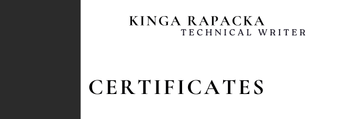

---
title: Certificates
layout: default
nav_order: 3
--- 

     

As a teacher and technical writer, I am committed to staying at the forefront of technology and innovation. Over the years, I’ve earned a range of certifications that enhance my ability to teach complex subjects, communicate technical information clearly, and apply cutting-edge tools such as Generative AI. These certifications not only demonstrate my expertise but also my dedication to continuous learning and professional growth.

They empower me to combine cutting-edge technologies like Generative AI with my passion for teaching and technical writing. They help me not only teach new and emerging topics with authority but also write clear, insightful documentation that reflects the latest advancements in technology. By staying updated with the latest in AI and other fields, I ensure that my students and readers receive the most relevant and impactful information.

## **Professional Development:**

| Date Completed | Certificate Title    | Issued By |
| ----           | -----------          | ----      |
|2024.11.09   |Generative AI         |Santander Open Academy/MIT Professional Education|
| 2024.09.14|Scrum Basics - Agile Project Management|Santander Open Academy|
| 2024.09.09|Google: Artificial intelligence and productivity|Santander Open Academy/Google|
|2024.10.11|Academy of MOTIVATION|Saint Wojciech publishing House|
| 2024.09.25|Discover the Art of Presentation. Design, Colors, and Composition in Practice|Saint Wojciech publishing House|
|2024.09.21   |Virtual Reality and the Metaverse Environment |WSB University|
|2024.09.20   |Pillars of Leadership Potential Assessment in Modern Organizations|WSB University|
|2024.09.20|How to Divide the Cake? Modern Methods of Negotiation|WSB University|
|2024.09.18   |New Technologies, New Challenges: Data Security in a Changing World|WSB University|
|2024.09.17   |Crucible of Reality: Deepfake Threats and Challenges in the Age of Digital Manipulation|WSB University|
|2024.09.16|AI in Business – Harness the Potential of Artificial Intelligence in Your Company|WSB University|

## **Personal Development**
| Date Completed | Certificate Title    | Issued By |
| ----           | -----------          | ----      |
| 2024.10.23 | Narrative Analysis in Working with the Bible        |Wydawnictwo WAM |
|2024.09.22 |Adolescent in a Mental Health Crisis – How to Recognize? How to Respond? How to Help?| WSB University|
|2024.09.20|The Importance of 'Ego' and 'Mojo' in Leadership: How to Develop and Maintain Engagement by Building an Authentic Leadership Model|WSB University|
|2024.04.25|Mindful Supplementation – How to Tailor Supplements to Your Needs|Saint Wojciech publishing House|
|2024.02.29|Passivity or Activity – Response to Suicide|Saint Wojciech publishing House |
|2023.11.15|Find Your Inner Balance!|Saint Wojciech publishing House |
||||
||||

## **Education & Teaching:**
| Date Completed | Certificate Title    | Issued By |
| ----           | -----------          | ----      |
| 2024.09.21 | With Empathy from Preschool       | WSB University|
| 2024.09.16 |Enslavement or Development? Dilemmas of Contemporary Education and Schools| WSB Univeristy|
| 2024.05.23|Calm Amongst the Turmoil|Saint Wojciech publishing House|
|2024.03.13|The Catechist in the Context of Homeschooling|Saint Wojciech publishing House|
|2024.03.09|21st National Catechetical Symposium ‘RETURN TO THE ORIGINAL LOVE’|Saint Wojciech publishing House |
|2024.02.07|Smiling Saints in Religious Education|Saint Wojciech publishing House|
|2024.01.31|Greek in Catechesis|Saint Wojciech publishing House |
|2023.12.14|Rollers, Relationships, Movies. New Technologies in Education|Saint Wojciech publishing House |
|2023.11.30|Advent JOY!|Saint Wojciech publishing House |
|2023.09.27|Evangelization in the Contemporary World: Ideas, Resources, Methods|Saint Wojciech publishing House |
|2023.09.06|Christian Board Games as Modern and Effective Educational Methods|Saint Wojciech publishing House|
|2023.03.11|21st National Catechetical Symposium ‘The Catechist in the Modern World|Saint Wojciech publishing House |
|2023.03.02|Do It Yourself – Methodological Support for Early School Catechists|Saint Wojciech publishing House |
||||
||||
||||
||||
||||
||||
||||
||||
||||
||||
||||
||||
||||
||||
||||
||||
||||
||||
||||
||||
||||
||||
||||
||||
||||

