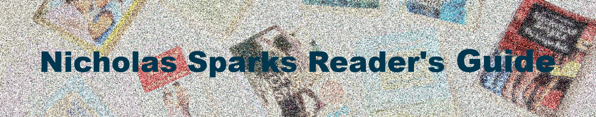

---
title: MadCap Flare Project
layout: default
nav_order: 6
--- 

# **MadCap Flare: Nicholas Sparks Reader's Guide**

This project was a technical documentation and web styling showcase, where I created a well-organized digital guide on Nicholas Sparks' books, movies, and his foundation. Leveraging MadCap Flare, custom CSS, and GitHub, I focused on producing a visually engaging and easy-to-navigate site that demonstrates my expertise in content structuring, styling, and publishing.

**<a href="https://kinrap.github.io/MadCapFL/Content/Home.htm" target="_blank"> MadCap Flare - Nicholas Sparks Reader's Guide</a>**

**Technologies & Tools Used:**

- MadCap Flare: I used MadCap Flare for topic-based authoring, allowing me to modularize content and create seamless navigation between different sections. I leveraged Flare’s features to implement breadcrumbs, sidebars, and responsive design, ensuring an intuitive user experience.
- CSS Customization: To enhance the look and feel, I implemented custom CSS, adjusting fonts, color schemes, layouts, and button styles. These modifications allowed me to tailor the appearance to a specific aesthetic, providing an attractive, user-centered interface.
- GitHub Publishing: I managed the entire project’s version control and publication on GitHub, which allowed for easy access, collaboration, and version tracking. [Include link to GitHub repository]

**Key Technical Skills Demonstrated**:

- Content Structuring: Through MadCap Flare, I organized the content into topics and subtopics, utilizing best practices in technical documentation to make the guide modular, searchable, and logically structured.
- Responsive Design: Using MadCap Flare and CSS, I ensured that the site is fully responsive, providing an optimal viewing experience across devices by adapting layouts, images, and fonts based on screen size.
- Advanced CSS Styling: I customized the look of the project with advanced CSS techniques, including pseudo-elements, flexbox layouts, and custom color schemes. This allowed me to achieve a polished, consistent style that enhances readability and user engagement.
- Repository Management on GitHub: By publishing the project on GitHub, I demonstrated my ability to handle version control, track changes, and manage project files in a collaborative, open-source environment.

This project exemplifies my ability to combine technical content development with custom styling to create user-friendly, visually engaging documentation. My proficiency with MadCap Flare and CSS allowed me to create a refined, professional resource, while GitHub provided a platform for public access and collaboration.