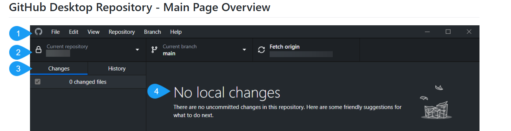

---
title: Main Page Overwiew
layout: default
nav_order: 8
--- 

# **GitHub Desktop - Main Page Overview**

This project is a comprehensive technical documentation piece that provides users with a clear guide to the main page interface of GitHub Desktop. Through annotated screenshots and step-by-step explanations, I documented the main elements of GitHub Desktop's interface to help users understand its key features and functions. This project exemplifies typical technical writing skills, including user-oriented documentation, visual annotation, and structured formatting.

**<a href="https://kinrap.github.io/GitHubDesktopConceptTopic/" target="_blank"> GitHub Desktop Main Page Overwiev</a>**

The project covers each section of the GitHub Desktop main page, from repository management options to synchronization controls and interface navigation. The guide is aimed at new users of GitHub Desktop, as well as experienced users seeking to make the most of its features.

**Tools & Technologies Used:**

- Snagit: I used Snagit to capture, edit, and annotate screenshots, making each feature clear and easy to locate within the interface. Highlights, callouts, and labels were added to ensure visual clarity.
- Markdown: All content was written and organized in Markdown, allowing for clean, accessible formatting that enhances readability.
 - GitHub: The project was published on GitHub, enabling easy public access, version control, and potential collaboration. 

**Key Technical Skills Demonstrated:**

- Technical Writing & Interface Documentation: I wrote concise, user-centered documentation to explain each feature and section of GitHub Desktop’s main page, focusing on making technical information accessible and clear.
- Visual Annotation: Using Snagit, I annotated screenshots to visually support the text, providing users with a guided view of each feature’s location and function within the GitHub Desktop interface.
- Content Structuring: The document is logically organized, with clear headings, bullet points, and links to navigate the overview easily, making the guide suitable for both quick reference and detailed learning.
- Version Control & Publishing on GitHub: By publishing this project on GitHub, I demonstrated my capability with version control and public documentation hosting, ensuring the project is accessible and easy to update.
  

This project highlights my strengths in technical writing and visual documentation, illustrating my ability to create user-friendly guides for software interfaces. By combining Markdown for structured content, Snagit for annotated visuals, and GitHub for publishing and version control, I delivered a polished, effective resource that enhances user experience with GitHub Desktop.