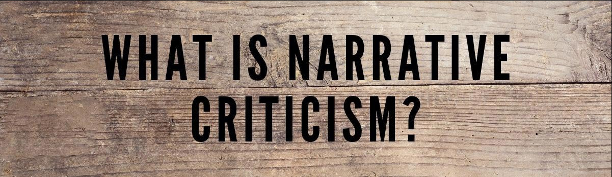

---
title: Markdown
layout: default
nav_order: 5
--- 
 

# **Skills in Markdown: Narrative Criticism Documentation**

One of my key skills is the ability to use Markdown for creating clear, well-structured, and easily maintainable documentation. 

As part of my work, I created a detailed project on narrative criticism, which I published on GitHub in Polish. This project allowed me to demonstrate both my understanding of narrative criticism and my ability to use Markdown to present complex information in a simple, accessible format.

**<a href="https://kinrap.github.io/MarkdownAnalizaNarracji/" target="_blank"> Markdown - What is Narrative Criticism (pl only)</a>**