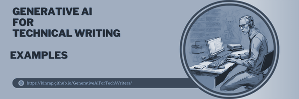

---
title: Prompt Design Strategy
layout: default
nav_order: 9
--- 

# **Prompt Design Strategies - Examples**

This project is a comprehensive study on prompt design strategies for Generative AI tools. Developed as the capstone of my diploma project in technical communication, this guide offers detailed insights and examples on designing effective prompts to maximize the accuracy and relevance of responses from generative AI models. I used a range of tools and technologies, including Markdown, XML, HTML, CSS, Snagit, GIMP, and Just the Docs, to create a polished, user-focused guide that is both visually engaging and informative.

**<a href="https://kinrap.github.io/GenerativeAIForTechWriters/Docs/WritingInstruction.html" target="_blank"> Prompt Design Strategies - Examples</a>**

The project explores best practices in prompt engineering by showing how different generative AI models—ChatGPT, Gemini, and Copilot—respond to variations in prompt structure, style, and specificity. It provides examples and guidelines for creating prompts tailored to specific tasks, such as summarization, creative generation, and problem-solving, with detailed explanations of why certain prompt structures work better than others.

**Technologies & Tools Used:**

- Markdown, HTML, and XML: These languages were used to structure and format the content, ensuring it was clean, readable, and logically organized.
- CSS Customization with Just the Docs: I customized the Just the Docs theme to fit the project’s needs, including styling modifications for improved readability, color schemes to highlight prompt examples, and layout adjustments for a user-centered design.
- Generative AI Models: I used ChatGPT, Gemini, and Copilot to demonstrate how each model responds to identical prompts, showcasing differences in output based on prompt phrasing.
- Snagit and GIMP: Snagit was used to capture high-quality screenshots, while GIMP provided additional graphic editing capabilities. These tools were instrumental in creating annotated visuals and comparison tables, highlighting each model’s response to the same prompt for easy comparison.
  

**Key Technical Skills Demonstrated:**

- Prompt Engineering: This project showcases my understanding of prompt engineering principles, demonstrating my ability to tailor prompts for various use cases and illustrating best practices in AI interactions.
- Multimodal Documentation: Through the combination of Markdown, XML, and HTML, I created layered, well-structured documentation that enables users to navigate between examples, explanations, and comparisons easily.
- CSS Styling & Customization: I used CSS to modify the Just the Docs theme, aligning the visual style with the project’s focus on clarity and readability. My customizations ensured a clean, professional design, including color-coded sections for different AI tools and prompt types.
- Visual Annotation: Using Snagit and GIMP, I created annotated screenshots and visual comparisons, allowing users to see how each AI model responds differently to the same prompt.
- Version Control & Publishing on GitHub: By hosting this project on GitHub, I showcased my skills in version control and public documentation sharing, ensuring the project is accessible and easy to update.

This project highlights my strengths in technical writing, prompt engineering, and visual design, demonstrating my ability to create clear, user-focused documentation for emerging technologies like generative AI. By blending structured content with visual elements and interactive comparisons, I delivered an engaging, informative resource for users looking to enhance their prompt design skills.