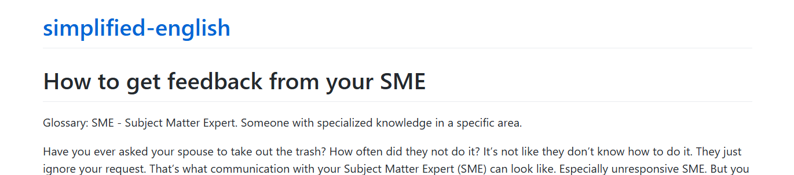

---
title: Simplified English
layout: default
nav_order: 11
--- 

# **Simplified English Version: How to get feedback from your SME**

In this project, I rewrote my original article, <a href="https://kinrap.github.io/UNSME/" target="_blank">"Happily Ever After with Unresponsive SMEs"</a>, using Simplified English, a controlled language often used in technical writing to improve clarity and ease of understanding. Simplified English is particularly useful for international audiences or when writing technical documentation that needs to be accessible to readers with varying levels of expertise or language proficiency.

**<a href="https://kinrap.github.io/simplified-english/" target="_blank"> Simplified English Version: How to get feedback from your SME</a>**

The revised article maintains the core content and strategies for working with unresponsive Subject Matter Experts (SMEs) but simplifies the language to ensure it’s easy to understand for a broader audience. It provides practical advice on managing SME communication, focusing on how technical writers can approach unresponsiveness with diplomacy, while also using clear, straightforward language that is easy to follow.

**Technologies & Tools Used:**

- Simplified English: I applied Simplified English rules throughout the article, focusing on clarity, avoiding jargon, and using short, simple sentences. This version of the article demonstrates my ability to adapt technical content for different audiences.
- Markdown: I wrote and structured the article in Markdown, ensuring that it remains readable and well-organized while adhering to Simplified English guidelines.
- GitHub Pages: The Simplified English version of the article was published on GitHub Pages, which shows my ability to use version control and publish accessible content online. 

**Key Skills Demonstrated:**

- Simplified English: This project showcases my proficiency in Simplified English—a critical skill for technical writers when creating clear, concise, and easy-to-understand documentation. I used Simplified English principles to ensure the content was accessible to all users, regardless of their language proficiency or technical background.
- Technical Writing for Accessibility: I rewrote the article with a focus on clarity, removing unnecessary complexity and ensuring that readers could easily grasp the core ideas without confusion. This demonstrates my ability to write for diverse audiences.
- Markdown & Web Publishing: As with the original version of the article, I used Markdown to create the content and GitHub Pages to publish it, showcasing my expertise in these tools for professional web publishing.
- Content Adaptation: By adapting my original article into a Simplified English version, I demonstrate my ability to modify content to suit different communication needs, whether for a specific audience or purpose.

This project highlights my ability to adapt complex content to make it more accessible, which is an essential skill for technical writers. By using Simplified English and applying Markdown for structure, I created a version of my article that is easy to understand while retaining the valuable insights on managing SME relationships. Through GitHub Pages, I made the content accessible for the wider community, showing how technical writers can use controlled language to enhance clarity and user comprehension.